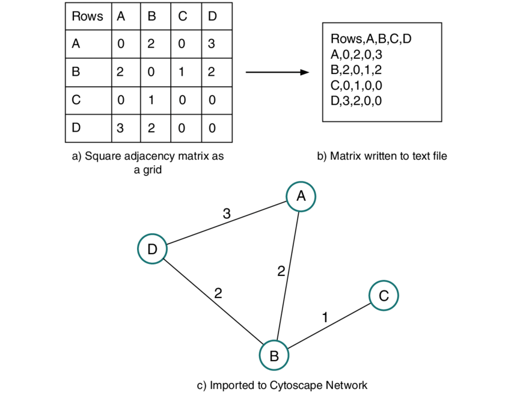

An adjacency matrix is a square matrix where the rows and columns represent the nodes of a graph. The entries in the matrix indicate whether there is an edge connecting two nodes. Typically, a value of 1/2/3 or true signifies the presence of an edge, while a value of 0 or false indicates its absence. For example, if we have a graph with four nodes labeled A, B, C, and D, the adjacency matrix might look like this:

In this matrix, the entry at position (A, B) is 2, indicating that there is an edge between nodes A and B having weight 2. Similarly, the entry at position (B, D) is 2, indicating an edge between nodes B and D with wieght 2.

The adjacency matrix is an efficient way to represent graphs, especially for dense graphs where the number of edges is close to the maximum possible. It allows for quick lookup of edge existence and enables various graph algorithms, such as depth-first search and breadth-first search, to be performed efficiently.

However, one limitation of the adjacency matrix is its space complexity. For large graphs with many nodes and relatively few edges, the matrix can become sparse, containing mostly zeros. In such cases, an alternative data structure like an adjacency list might be more suitable.